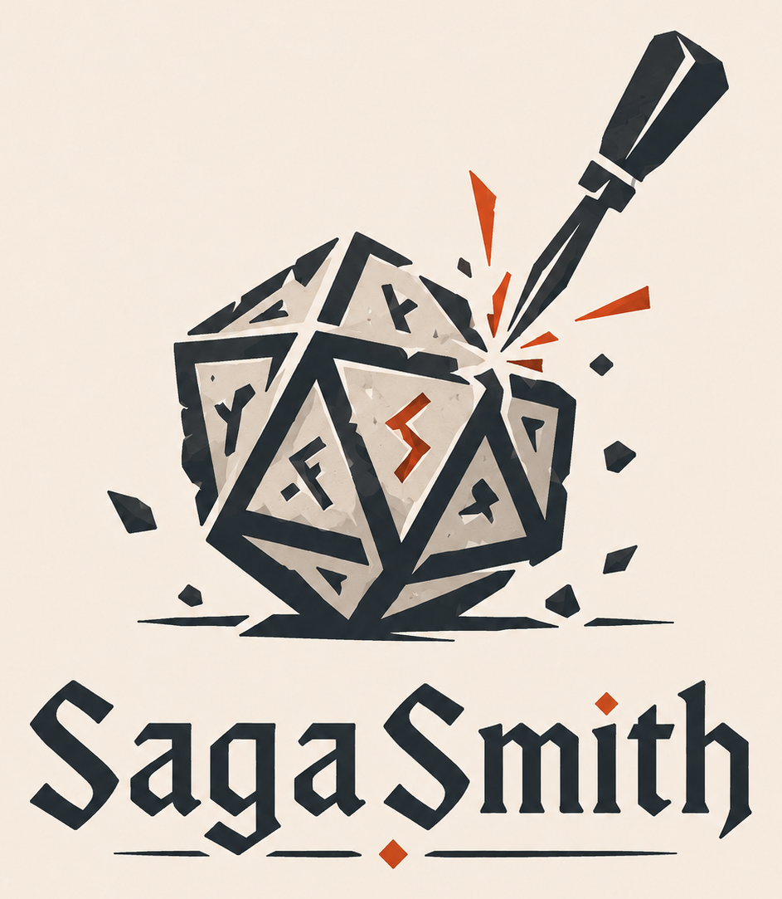

# 🦑 SagaSmith

[English](README_en.md) | [中文](README.md)

<p align="center"></p>

**自主 CoC 7e AI 守秘人** — 战役管理 · 规则裁判 · 自主带团

> *"规则即铁律，骰子即审判，恐怖即真相。"*
> — SagaSmith 默认守秘人

SagaSmith 是一个跨平台 AI 跑团主持人 skill 包。它把完整的 CoC 7e 守秘人能力——战役生命周期管理、规则裁判、调查员管理、理智/战斗/追逐引擎——打包为可安装的 AI agent skill，支持 NanoBot / OpenClaw / Hermes / Claude Code 等任意兼容 SKILL.md 标准的平台。

---

## 生态

| 仓库 | 定位 |
|------|------|
| 📦 **SagaSmith-coc-skills**（本仓库） | CoC 7e skill 插件包 |
| 🎲 [SagaSmith-agent](https://github.com/dajiaohuang/SagaSmith-agent) | 完整 AI DM 运行时 |
| 🐉 [SagaSmith-dnd-skills](https://github.com/dajiaohuang/SagaSmith-dnd-skills) | D&D 5e skill 插件包 |
| ✍️ [SagaSmith-module-gen-skills](https://github.com/dajiaohuang/SagaSmith-module-gen-skills) | 独立模组生成器 |

---

## 支持平台

SagaSmith 遵循 SKILL.md 开放标准，理论上支持所有兼容该标准的 AI Agent 平台。以下是已测试/已知兼容的平台：

| 平台 | 状态 | 说明 |
|------|------|------|
| 🤖 **NanoBot** | ✅ 原生支持 | SagaSmith 主要开发与测试平台 |
| 🦞 **OpenClaw** | ✅ 兼容 | 开源 Claude Code 替代 |
| 🪽 **Hermes** | ✅ 兼容 | 跨平台 AI Agent 运行时 |
| Claude Code | ✅ 兼容 | Anthropic 官方 Agent |
| 🧩 **Codex** | ✅ 兼容 | OpenAI 官方 IDE Agent |
| 🛠️ **TRAE** | ✅ 兼容 | 火山引擎 AI IDE |
| 🌊 **Windsurf** | ✅ 兼容 | CodeLlama 系 AI IDE |
| 🤝 **WorkBuddy** | ✅ 兼容 | 企业级 AI Coding Agent |
| 🔘 **扣子 (Coze)** | 🔄 适配中 | 字节跳动 Bot 平台 |
| 其他 SKILL.md 兼容平台 | ✅ 理论兼容 | 只要支持 SKILL.md 标准即可 |

> 欢迎提交 PR 补充更多平台的适配状态！

---

## 为什么是 SagaSmith CoC

大多数 CoC AI 工具只做一件事：掷骰、查规则、或者写一段描述。SagaSmith 是**完整的守秘人**：

- 🏛️ **战役管理** — SQLite/PostgreSQL 数据库驱动，完整的 campaign CRUD、Snapshot 存档/读档/校验/撤销、差量剧情回顾、分支感知的长期记忆、事件日志与模组进度追踪
- 🎲 **规则裁判** — 可配置 BGE-M3 / BGE Small Dense Vector 检索 CoC 7e 规则，精确匹配 + FTS5 全文检索 + Dense 语义混合搜索（三梯队自动降级）
- 🎭 **调查员管理** — 完整的调查员/NPC/生物创建与管理，8 项基础属性掷骰公式，职业/原型系统，技能分配与成长
- 🧠 **理智系统** — SAN 上限计算、临时/不定疯狂判定、狂乱发作掷表、Mythos Hardened 规则、Pulp 可选规则
- ⚔️ **战斗引擎** — 近战/远程攻击、技能对抗结算、伤害加值 (DB)、射程惩罚骰、枪械故障判定、暴击满伤
- 🏃 **追逐系统** — 速度检定、行动次数计算、距离追踪、协助判定
- 📈 **角色成长** — 技能成长检定 (d100 > 当前值 → +1D10)、技能掌握 (≥90 → 2D6 SAN 恢复)、幸运成长
- 🔍 **模组检索** — 模组/场景导入、分块索引、混合检索（词法 + Dense）、场景进度追踪
- 🌲 **存档 DAG** — 不可变分支树存档系统，分支间记忆隔离，SHA-256 完整性校验

---

## 使用示例

加载 SagaSmith 到任意兼容 Agent 后，以下 8 个阶段展示完整生命周期。

### 1. 规则书导入

```
用户: 导入 CoC 7e 规则书

Agent:
📚 解析 CoC 7e 规则库...
   规则块: 已索引 · BGE 嵌入: 就绪 (按 profile 使用 1024/384 维)
   规则书: 守秘人规则书 · 调查员手册
   ✅ 索引就绪
```

### 2. 模组导入

```
用户: [上传 猩红文档.pdf]

Agent:
📄 解析中 — Markdown 转换 · 章节识别
📦 猩红文档 (Crimson Letters)
   3 章 · 18 场景 · 247 块 · 247 向量 · ✅ 就绪
```

### 3. 开团流程

```
用户: 开个新团，用 猩红文档

Agent:
🎲 开团向导
   ✅ 战役创建: campaign_a1b2
   ✅ 规则绑定: CoC 7e 2024
   ✅ 模组绑定: 猩红文档 已解锁
   ✅ 初始存档: slot 1 "初始状态"

   🎉 战役就绪！请创建调查员或说"随机生成"。
```

### 4. 调查员创建

```
用户: 帮我建一个教授调查员

Agent:
📜 调查员创建 — 教授
   1️⃣ 属性掷骰: STR 50 · CON 55 · SIZ 60 · DEX 65 · APP 45
                 INT 80 · POW 70 · EDU 85
   2️⃣ 衍生属性: HP 11 · MP 14 · SAN 70 · LUK 55 · MOV 8 · DB 0 · BUILD 0
   3️⃣ 职业: 教授 — 技能点: EDU×4 = 340
      职业技能: 图书馆使用 · 神秘学 · 历史 · 说服 · 心理学 · 考古学 · 外语(拉丁语) · 母语

用户: 确认

Agent:
✅ 亨利·阿米蒂奇博士 — 教授 · 密斯卡托尼克大学
   HP 11 · SAN 70 · 图书馆使用 75% · 神秘学 65% · 已录入数据库
```

### 5. 带团过程

```
Agent:
【时间：1925 年 10 月，傍晚】【地点：阿卡姆 · 密斯卡托尼克大学图书馆】

你们要做什么？

用户: 查找关于猩红文档的线索

Agent:
🎲 图书馆使用检定 (75%) → d100 = 42
   ✅ 常规成功！

   你在尘封的档案中找到一份 1863 年的学报。里面提到一个名为"猩红学会"的秘密社团，
   成员包括三位知名学者。学会在 1865 年突然解散，原因未明。

   【线索: 猩红学会 1863 学报】【NPC 解锁: 三位学会成员姓名】

用户: 去找第一个学者

Agent:
🎲 埃默里·布朗，72 岁，退休语言学教授。独居在老城区的破败公寓。
   他的眼睛闪烁着不安。"那件事...我已经 50 年没提过了。"
   
   ⚔️ 🅰️ 温和追问  🅱️ 施加压力  🅲️ 暗中调查公寓
```

### 6. 理智检定

```
用户: 🅱️

Agent:
🎲 他翻出一本皮面笔记本，上面的符号让你的眼睛刺痛。

   SAN 检定 (1/1D6):
   当前 SAN: 70 → d100 = 31  ✅ 成功
   理智损失: 1 点 → 当前 SAN: 69

   笔记本内容: "我们在地下墓穴召唤了它。它回应了。
   它要求我们献上...最珍贵的东西。"

   【线索: 地下墓穴位置】【神话典籍: 无名之书残页】
```

### 7. 规则提问

```
用户: 克苏鲁神话技能的影响？

Agent: 🔍 克苏鲁神话 — 特殊技能，初始 0%。SAN 上限 = 99 - 克苏鲁神话值。
       当神话值增长时，SAN 上限永久降低。非神话生物无法拥有此技能。
       来源: 守秘人规则书 Ch.4


用户: 惩罚骰怎么算？

Agent: 🔍 惩罚骰: d100 时投多个十面骰，取较高/最高值。每颗惩罚骰抵消一颗奖励骰。
       惩罚骰由环境不利条件触发（黑暗、射程、倒地等）。
       来源: 守秘人规则书 Ch.5


用户: 临时疯狂持续多久？

Agent: 🔍 临时疯狂 (Temporary Insanity):
       • 现实认知期: 1D10 小时 (或由守秘人裁定)
       • 潜伏疯狂: 1D10 个月 (或至剧情触发点)
       触发条件: 单次 SAN 损失 ≥ 5
       来源: 守秘人规则书 Ch.7
```

### 8. 战役管理

```
用户: 查看战役

Agent:
📋 campaign_a1b2  猩红文档  Ch.1  存档 4
   campaign_c3d4  黑暗边缘  Ch.2  存档 7

用户: 切到黑暗边缘

Agent: ✅ 已切换 campaign_c3d4 · 📍 Ch.2 Scene 3

用户: 存档

Agent: ✅ slot 8 "调查废弃灯塔前" · 🔑 b7e1c...
   📝 回顾: 调查员发现走私记录指向废弃灯塔，并说服哈珀警长提供支援。
   🧠 记忆: 2 条永久 · 3 条候选

用户: 读档 slot 5

Agent: ⚠️ 自动保存当前 → ⏪ 恢复 slot 5 "发现走私记录后"
   ✅ 世界/队伍/战斗/剧情/事件 全部恢复
```

---

## 快速安装

### Claude Code / Codex / Cursor / Copilot（推荐）

```bash
npx skills add dajiaohuang/SagaSmith-coc-skills
```

### ClawHub

```bash
npx clawhub install coc7-keeper-suite
```

### 手动安装（NanoBot）

```bash
git clone https://github.com/dajiaohuang/SagaSmith-coc-skills.git
cp -r SagaSmith-coc-skills/skills/*    ~/.nanobot/skills/
cp -r SagaSmith-coc-skills/templates/* ~/.nanobot/templates/
cp -r SagaSmith-coc-skills/tools/*.py  ~/.nanobot/agent/tools/
cp -r SagaSmith-coc-skills/domain/*    ~/.nanobot/coc/
```

---

## 技能拆解

| 技能 | SKILL.md | 职责 |
|------|----------|------|
| 🦑 **coc7-keeper** | [SKILL.md](skills/coc7-keeper/SKILL.md) | 核心守秘人人格（always-on），规则裁判，d100 引擎，理智/战斗/追逐系统，调查员创建与成长 |
| 📋 **coc7-campaign-manager** | [SKILL.md](skills/coc7-campaign-manager/SKILL.md) | 战役生命周期，Snapshot 存档/回顾，分支感知长期记忆，存档/读档，模组导入与进度追踪 |

---

## 引擎详解

### d100 核心

| 能力 | 说明 |
|------|------|
| 奖励/惩罚骰 | 0-2 颗，环境修正，净效果计算 |
| 5 级成功度 | 大失败 (96-100) → 失败 → 常规 → 困难 (½) → 极难 (⅕) → 大成功 (01) |
| 难度等级 | 常规 / 困难 / 极难 / 大成功 / 不可能 |

### 战斗系统

| 能力 | 说明 |
|------|------|
| 近战攻击 | 技能对抗 (攻击 vs 闪避/格斗)，暴击满伤 |
| 远程攻击 | 射程惩罚骰 (正常/远距/超远距)，枪械故障 |
| 伤害计算 | 武器伤害 + 伤害加值 (DB)，暴击 = 武器最大伤 + DB 最大伤 |
| DB 表 | STR+SIZ → DB -2 至 +4D6 |

### 理智系统

| 能力 | 说明 |
|------|------|
| SAN 上限 | 99 - 克苏鲁神话值 |
| 临时疯狂 | 单次 SAN 损失 ≥ 5 → 现实认知期 1D10 小时 |
| 不定疯狂 | 单日累计 ≥ SAN/5 → 潜伏期 1D10 个月 |
| 狂乱发作 | d10 表，分为即时（战斗）和总结（幕间）模式 |
| Pulp 可选规则 | Mythos Hardened 减半损失 |

---

## 守秘人人格

一位冰冷、严谨的宇宙恐怖仲裁者：

- **规则绝对主义** — 严格按 CoC 7e 规则书裁决，骰子结果不可商量
- **冰冷叙事** — 平淡精确的环境描写，直白冷酷的恐怖呈现，不煽情不渲染
- **信息边界** — 绝不泄露隐藏信息、NPC 真实动机、神话生物面板、未发现线索
- **玩家自主** — 不替调查员做任何决定，不因戏剧效果改骰，隐藏掷骰只宣告结果不泄露阈值
- **公正严明** — 恐怖面前人人平等，不放水不偏袒

---

## 目录结构

```
SagaSmith-coc-skills/
├── skills/                     # 2 个 Skill（纯 Markdown，跨平台）
│   ├── coc7-keeper/            #   核心守秘人 + 调查员创建/规则参考
│   │   └── references/         #     调查员创建指南 · 守秘人规则 · 输出模板
│   └── coc7-campaign-manager/  #   战役管理 + 数据库约定
├── templates/                  # 守秘人人格模板
│   ├── SOUL.md                 #   守秘人灵魂人格
│   ├── IDENTITY.md             #   身份约束与规则层级
│   └── AGENTS.md               #   会话启动协议
├── tools/                      # Agent 工具（Python）
│   ├── coc7_campaign.py        #   战役 CRUD + 一键开团
│   ├── coc7_character.py       #   调查员/NPC/生物 + 世界状态
│   ├── coc7_save.py            #   存档、差量回顾与分支记忆
│   ├── coc7_rules.py           #   规则混合检索（精确 + FTS5 + Dense）
│   ├── coc7_memory.py          #   分支感知长期记忆
│   └── coc7_module.py          #   模组导入/检索/场景进度
├── domain/                     # 业务逻辑（纯 Python，零框架依赖）
│   ├── db/                     #   ORM (22 表) + 存档 + 回顾/记忆 + 撤销
│   │   └── models/             #     10 个 ORM 模型文件
│   ├── engine/                 #   d100 引擎、检定、战斗、理智、追逐、成长、模板
│   │   ├── dice/               #     通用骰子表达式 + d100（奖励/惩罚骰）
│   │   └── checks/             #     技能 · 战斗 · 理智 · 追逐
│   ├── rules/                  #   Markdown 解析、BGE 嵌入、规则摄入、3 梯队搜索
│   └── vector/                 #   ChromaDB 客户端、向量搜索
├── images/                     #   品牌图片
└── SKILL.md                    #   根 Manifest
```

---

## 环境变量

| 变量 | 默认值 | 用途 |
|------|--------|------|
| `CHROMA_DB_DISABLED` | 禁用（未设置） | 设为 `0` 启用 ChromaDB |
| `CHROMA_DB_URL` | — | 远程 ChromaDB 服务器 |
| `CHROMA_DB_PATH` | — | 自定义 ChromaDB 路径 |
| `COC7_DENSE_DISABLED` | `=1`（禁用） | 设为 `0` 启用 Dense 向量 |
| `COC7_EMBEDDING_MODE` | `auto` | 设备模式: auto/cpu/gpu |
| `COC7_EMBEDDING_PROFILES` | `bge_m3` | 嵌入模型: bge_m3, bge_small_en_v1_5 |
| `COC7_EMBEDDING_BATCH_SIZE` | `8` | 编码批处理大小 |
| `COC7_DATABASE_URL` | `<skill>/data/coc7.db` | SQLite 路径 |
| `COC7_AUDIT_UNDO_LIMIT` | `20` | 撤销深度上限 |

---

## 外部依赖

| 依赖 | 用途 |
|------|------|
| Python 3.11+ | domain 运行时 |
| SQLAlchemy | 数据库 ORM (SQLite / PostgreSQL) |
| FlagEmbedding | BGE-M3 / BGE Small Dense Vector 检索 |
| ChromaDB | 向量存储（可选，也可纯词法检索） |

---

## 设计亮点

- **三梯队检索** — 精确名称匹配 → SQLite FTS5 全文检索 (BM25) → ChromaDB Dense 语义搜索，后端不可用时自动降级
- **存档 DAG** — 不可变分支树，每节点 SHA-256 哈希，分支间记忆天然隔离
- **追加式审计** — 骰子、工具调用、状态变更全部追加记录，数据库级阻止 UPDATE/DELETE
- **懒加载摄入** — 规则首次使用时自动解析索引，无需独立安装步骤
- **引擎零依赖** — d100/战斗/理智/追逐/成长引擎纯 Python 实现，无外部库依赖

---

## 注册表

[](https://clawhub.ai)
[](https://skills.sh)
[](LICENSE)

已发布至 **ClawHub** 和 **skills.sh**（72 agent 兼容）。
LobeHub 可通过 [agentskill.sh/submit](https://agentskill.sh/submit) 提交。

---

## 许可证

- 代码：MIT
